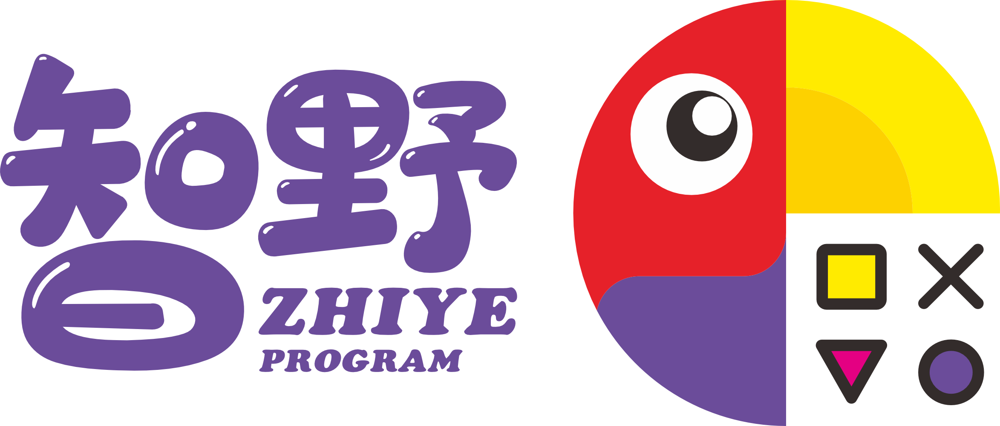

	

<h4 align="center">信息奥林匹克竞赛 C++ 学习项目</h4>

# 信息学奥林匹克竞赛学习分享项目

## 一、项目简介
本项目旨在为信息学奥林匹克竞赛的学习者提供一个全面且系统的学习资源集合，涵盖从计算机基础到 C++ 编程基础、算法、数据结构以及往年真题的详细内容，帮助大家逐步掌握竞赛所需的各项技能，顺利在竞赛中取得优异成绩。

## 二、项目结构
- **计算机基础**：
    - 操作系统概述：介绍常见操作系统的基本功能与使用方法，如 Windows、Linux 等。
    - 计算机网络基础：讲解网络的基本概念、IP 地址、网络协议等知识，为后续网络编程相关内容做铺垫。
    - 计算机组成原理：简单阐述计算机硬件系统的组成结构，包括 CPU、内存、硬盘等部件的工作原理。
- **C++ 基础**：
    - 语法入门：详细讲解 C++ 的基本数据类型、变量声明与赋值、运算符、控制结构（如 if-else、循环语句）等语法知识，并配以大量示例代码帮助理解。
    - 函数与模块化编程：介绍函数的定义、参数传递、返回值以及如何通过函数进行模块化编程，提高代码的可读性和可维护性。
    - 类与对象：深入探讨 C++ 的面向对象编程特性，包括类的定义、成员变量与成员函数、构造函数与析构函数、继承与多态等概念，并通过实际案例展示其应用场景。
- **算法**：
    - 排序算法：详细讲解常见的排序算法，如冒泡排序、插入排序、选择排序、快速排序、归并排序等，分析其时间复杂度和空间复杂度，并通过代码实现和示例演示帮助理解算法的工作原理和应用场景。
    - 搜索算法：介绍线性搜索、二分搜索等基本搜索算法，以及深度优先搜索（DFS）和广度优先搜索（BFS）这两种在图论中常用的搜索算法，通过实例展示如何运用这些算法解决实际问题。
    - 动态规划：讲解动态规划的基本思想和解题步骤，通过经典的动态规划问题，如背包问题、斐波那契数列、最长公共子序列等，帮助学习者掌握这一重要的算法设计策略，并学会如何分析问题的最优子结构和重叠子问题，从而设计出高效的动态规划算法。
    - 贪心算法：介绍贪心算法的基本概念和应用场景，通过讲解一些典型的贪心算法问题，如活动安排问题、哈夫曼编码等，让学习者理解贪心算法的贪心选择性质和最优子结构性质，并学会如何运用贪心策略解决实际问题。
- **数据结构**：
    - 数组与链表：详细介绍数组和链表这两种基本的数据结构，包括它们的定义、存储方式、操作方法（如插入、删除、查找等）以及优缺点对比，并通过代码实现和示例演示帮助学习者掌握这两种数据结构的使用技巧。
    - 栈与队列：讲解栈和队列的基本概念、操作特性（先进后出和先进先出）以及在实际编程中的应用场景，如函数调用栈、表达式求值、广度优先搜索中的队列应用等，并通过代码实现让学习者熟悉这两种数据结构的操作方法。
    - 树与二叉树：深入介绍树的基本概念、术语（如节点、父节点、子节点、深度、高度等）以及二叉树的特殊性质和存储方式（顺序存储和链式存储），详细讲解二叉树的遍历算法（前序遍历、中序遍历、后序遍历和层次遍历）及其递归和非递归实现方式，并通过示例展示二叉树在实际问题中的应用，如二叉搜索树、哈夫曼树等。
    - 图：介绍图的基本概念、术语（如顶点、边、度、连通图、强连通分量等）以及图的存储方式（邻接矩阵和邻接表），详细讲解图的遍历算法（深度优先搜索和广度优先搜索）及其应用场景，如最短路径问题（Dijkstra 算法、Floyd 算法）、最小生成树问题（Prim 算法、Kruskal 算法）等，并通过代码实现和示例演示帮助学习者掌握图的相关算法和应用。
- **往年题目集合**：
    - 按照年份和题目难度进行分类整理，每个题目都包含题目描述、输入输出格式、样例数据以及解题思路和参考代码，帮助学习者了解竞赛题目的出题风格和解题方法，同时通过实际练习提高解题能力和编程技巧。

## 三、如何使用本项目
1. 建议按照项目结构的顺序依次学习各个模块的内容，从计算机基础开始，逐步深入到 C++ 编程、算法和数据结构等知识领域，最后通过做往年真题来巩固所学知识和提高解题能力。
2. 在学习每个知识点时，先仔细阅读相关的理论讲解和示例代码，理解其基本概念和原理，然后尝试自己动手编写代码实现相关功能，加深对知识点的掌握程度。
3. 对于算法和数据结构部分的学习，建议多结合实际问题进行思考和练习，分析如何运用所学的算法和数据结构来解决这些问题，提高自己的算法设计和编程能力。
4. 在做往年题目时，先尝试自己独立思考解题思路，然后再参考项目中提供的解题思路和参考代码，对比自己的解法和参考解法的优缺点，总结解题经验和技巧，不断提高自己的解题能力和竞赛水平。

## 四、学习资源推荐
- [《算法导论》](https://book.douban.com/subject/20432061/)：一本被广泛认为是算法领域的经典教材，详细介绍了各种算法的设计与分析方法，涵盖了排序、搜索、动态规划、贪心算法、图算法等众多重要内容，适合有一定基础的学习者深入学习算法知识。
- [《C++ Primer》](https://book.douban.com/subject/25708312/)：C++ 领域的权威入门书籍，对 C++ 的语法、特性和编程规范进行了全面而深入的讲解，书中的示例丰富且详细，有助于初学者系统地学习 C++ 编程基础。
- [洛谷](https://www.luogu.com.cn/)：一个专注于信息学竞赛的在线学习平台，提供了大量的竞赛题目、题解、学习资料和在线评测系统，学习者可以在平台上进行在线编程练习和交流学习，了解竞赛动态和其他学习者的经验分享。
- [AcWing](https://www.acwing.com/)：该网站提供了丰富的算法课程和题目练习资源，其算法课程讲解深入浅出，配合大量生动的动画演示和实例分析，帮助学习者更好地理解算法的原理和应用，同时网站上的题目分类清晰，难度适中，适合不同层次的学习者进行练习和提高。

## 五、贡献与反馈
本项目欢迎大家的贡献和反馈，如果您在学习过程中发现了任何错误、遗漏或者有更好的学习资料和方法推荐，欢迎您提交 Pull Request 或者 Issue，我们将一起努力完善这个项目，为更多的信息学奥林匹克竞赛学习者提供更好的帮助。

## 六、版权声明
本项目中的所有学习资料和代码仅供学习交流使用，请勿用于商业用途。部分资料和代码可能引用自其他公开资源，如有侵权，请及时联系我们，我们将立即删除相关内容。

祝您在信息学奥林匹克竞赛的学习道路上取得成功！

[FutureWL/魏来](https://github.com/FutureWL)

[2024/12/22]

---
