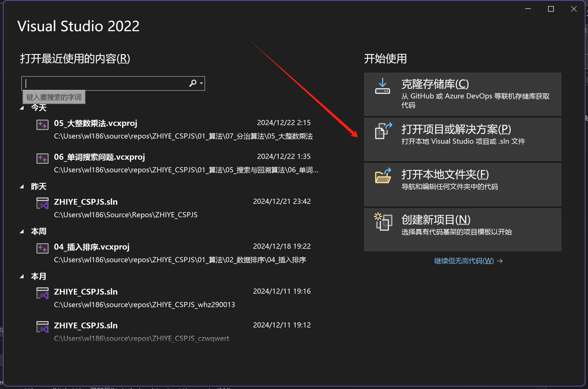
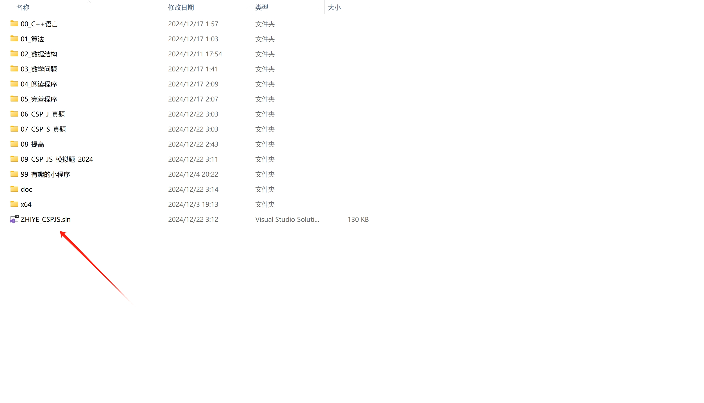
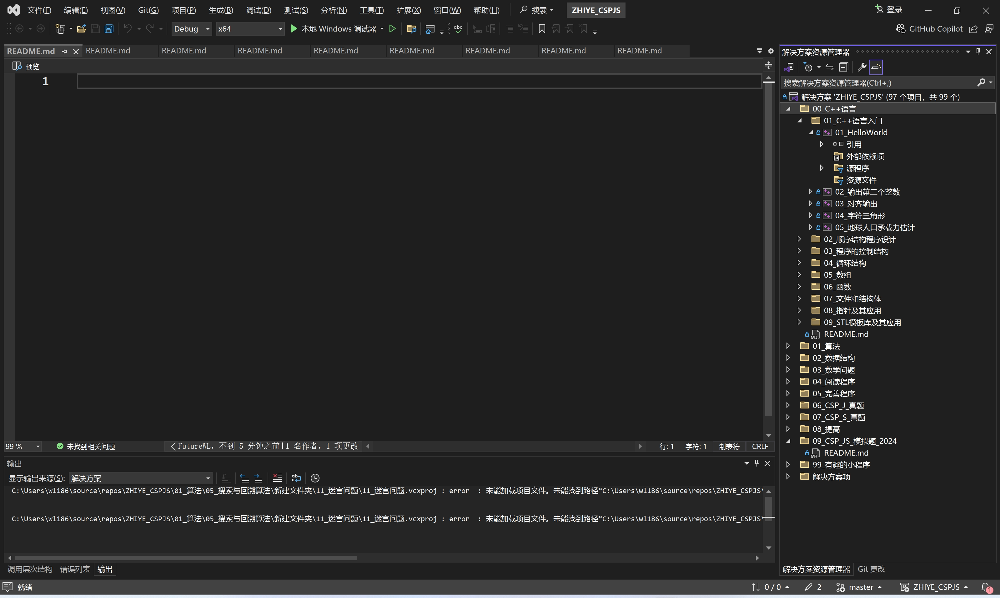

# 信息学奥林匹克竞赛学习项目快速入门

## 一、前提条件
确保您的计算机已经安装了适合的编程开发环境，例如 [具体开发环境名称，如 Visual Studio Code 或 Dev-C++ 等]，并且具备基本的代码编辑和运行能力。

## 二、操作步骤

### 1. Clone 项目
- 打开您的终端（在 Windows 系统中可以是 Git Bash，在 Mac 或 Linux 系统中直接使用终端应用）。
- 切换到您希望存放项目的目录，例如使用 `cd [目标目录路径]` 命令。
- 执行 `git clone [项目的 Git 仓库地址]` 命令，将本项目克隆到您的本地计算机。这一步操作会将项目的所有文件和文件夹下载到您指定的目录下，确保您的网络连接稳定，等待克隆过程完成。

### 2. 选择项目启动文件
- 进入克隆到本地的项目文件夹，找到 `src` 目录（如果存在这样的目录结构，具体名称可能因项目实际情况而异）。
- 在 `src` 目录中，查找以 `.cpp` 结尾的文件，这些通常是 C++ 代码文件，其中可能有一个被设计为项目的入口点，例如 `main.cpp`。如果项目结构不同，可能需要根据项目的说明文档或者代码逻辑来确定哪个文件是启动文件。

### 3. 加载项目
- 打开您安装的编程开发环境。
- 在开发环境中，选择“打开项目”或“导入项目”等类似的操作（具体菜单选项因开发工具而异）。
- 导航到您克隆项目的本地目录，选择项目文件夹，然后点击“确定”或“打开”按钮，将项目加载到开发环境中。此时，您应该能够在开发环境的项目资源管理器中看到项目的文件结构和代码文件。

### 4. 设置项目为启动项目
- 在开发环境的项目设置或运行配置中，找到“启动项目”或“主文件”等相关设置选项。
- 将之前选择的项目启动文件（如 `main.cpp`）设置为启动项。这一步操作的具体方式取决于您使用的开发工具，一般可以在项目属性、运行配置或调试设置中找到相应的设置项，并从下拉列表中选择正确的启动文件。

完成以上步骤后，您就可以在开发环境中运行项目，开始您的信息学奥林匹克竞赛学习之旅。如果在操作过程中遇到任何问题，请参考项目的文档说明或者开发环境的官方帮助文档，以获取更详细的指导信息。

---
